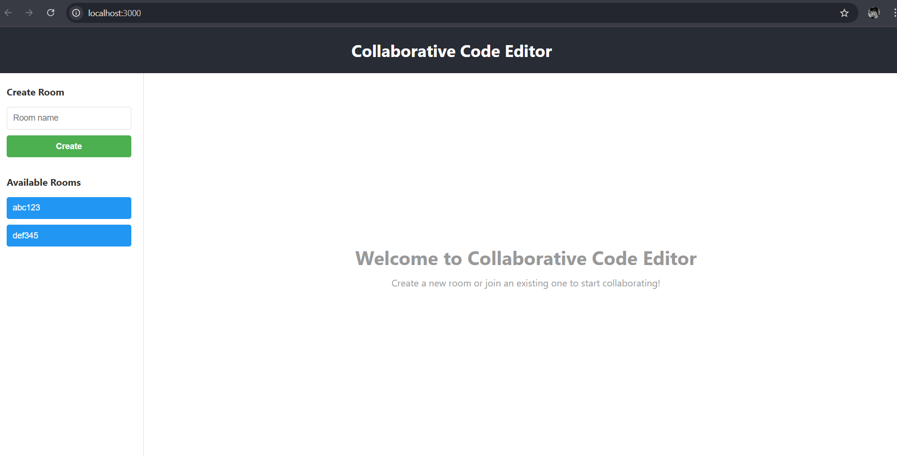

# Collaborative Code Editor

A real-time collaborative code editor built with FastAPI and React/TypeScript, allowing multiple users to edit code simultaneously in shared rooms.

## Features

✨ **Real-time Collaboration**: Edit code simultaneously with other users in shared rooms using WebSocket technology
🎨 **Multiple Language Support**: Support for JavaScript, Python, TypeScript, Java, and more
📝 **Code Persistence**: Code changes are automatically saved to the database
🔍 **Autocomplete**: Smart autocomplete suggestions based on the programming language
👥 **Active Users Tracking**: See how many users are currently in each room
🗂️ **Room Management**: Create, join, and manage collaborative editing rooms
⚡ **Fast Performance**: Built with FastAPI for high performance and WebSocket support

## Project Structure

```
your-project-repo/
├── backend/                          # FastAPI backend
│   ├── app/
│   │   ├── __init__.py
│   │   ├── main.py                  # FastAPI application entry point
│   │   ├── config.py                # Configuration settings
│   │   ├── db.py                    # Database setup and session management
│   │   ├── models/                  # SQLAlchemy models
│   │   │   └── __init__.py          # User, Room, CodeEdit models
│   │   ├── routers/                 # API route handlers
│   │   │   ├── __init__.py
│   │   │   ├── rooms.py             # Room management endpoints
│   │   │   ├── autocomplete.py      # Autocomplete suggestions
│   │   │   └── websocket.py         # WebSocket endpoints for real-time collaboration
│   │   ├── services/                # Business logic
│   │   │   ├── __init__.py
│   │   │   ├── room_service.py      # Room operations
│   │   │   └── autocomplete_service.py  # Autocomplete logic
│   ├── venv/                        # Python virtual environment
│   ├── requirements.txt             # Python dependencies
│   ├── .env                         # Environment configuration
│   └── alembic/                     # Database migrations (optional)
│
├── frontend/                        # React/TypeScript frontend
│   ├── src/
│   │   ├── components/              # Reusable React components
│   │   │   ├── CodeEditor.tsx       # Main code editor component
│   │   │   ├── UserList.tsx         # Active users display
│   │   │   └── Autocomplete.tsx     # Autocomplete suggestions UI
│   │   ├── pages/                   # Page components
│   │   ├── store/                   # State management (if needed)
│   │   ├── App.tsx                  # Main App component
│   │   ├── App.css                  # Main styles
│   │   ├── index.tsx                # React entry point
│   │   └── index.css                # Global styles
│   ├── public/
│   │   └── index.html               # HTML entry point
│   ├── package.json                 # NPM dependencies
│   ├── tsconfig.json                # TypeScript configuration
│   └── .env                         # Frontend environment variables
│
├── README.md                        # Project documentation (this file)
├── .gitignore                       # Git ignore file
└── docker-compose.yml              # Docker setup (optional)
```

## Prerequisites

- Python 3.8+
- Node.js 16+
- npm or yarn

## Installation

### Backend Setup

1. **Navigate to the backend directory**:

   ```powershell
   cd .\backend\
   ```

2. **Activate the virtual environment**:

   ```powershell
   .\venv\Scripts\Activate.ps1
   ```

3. **Install dependencies** (if not already installed):

   ```powershell
   pip install -r requirements.txt
   ```

4. **Create database** (SQLite):
   ```powershell
   # The database will be created automatically on first run
   ```

### Frontend Setup

1. **Navigate to the frontend directory**:

   ```powershell
   cd .\frontend\
   ```

2. **Install dependencies**:
   ```powershell
   npm install
   ```

## Running the Application

### Option 1: Run Backend and Frontend in Separate Terminals

**Terminal 1 - Backend**:

```powershell
# Navigate to backend directory
cd .\backend\

# Activate virtual environment
.\venv\Scripts\Activate.ps1

# Run the FastAPI server
python -m uvicorn app.main:app --reload
```

The backend will be available at: **http://localhost:8000**

**Terminal 2 - Frontend**:

```powershell
# Navigate to frontend directory
cd .\frontend\

# Start the development server
npm start
```

The frontend will be available at: **http://localhost:3000**

## API Endpoints

### Room Management

- **POST** `/api/rooms/create` - Create a new room

  ```json
  {
    "room_name": "My Room",
    "language": "javascript"
  }
  ```

- **GET** `/api/rooms/` - Get all rooms

- **GET** `/api/rooms/{room_id}` - Get specific room

- **PUT** `/api/rooms/{room_id}/code` - Update room code

  ```json
  {
    "code": "console.log('Hello World')"
  }
  ```

- **POST** `/api/rooms/{room_id}/members/{user_id}` - Add member to room

- **DELETE** `/api/rooms/{room_id}/members/{user_id}` - Remove member from room

- **DELETE** `/api/rooms/{room_id}` - Delete room

### Autocomplete

- **POST** `/api/autocomplete/suggestions` - Get autocomplete suggestions

  ```json
  {
    "language": "javascript",
    "prefix": "func",
    "room_id": "room123"
  }
  ```

- **GET** `/api/autocomplete/{room_id}/{line_number}` - Get code context at specific line

### WebSocket

- **WS** `/ws/editor/{room_id}` - Real-time code editing WebSocket connection

- **GET** `/ws/rooms/{room_id}/connections` - Get active connections in room

### Health Check

- **GET** `/health` - Health check endpoint

- **GET** `/` - Root endpoint with app info

## Usage Guide

### Create a Room

1. Enter a room name in the "Create Room" section on the left sidebar
2. Click the "Create" button
3. The room will be created and you'll be automatically joined

### Join a Room

1. Select a room from the "Available Rooms" list
2. The room content will load and you'll be connected

### Edit Code

1. Type or paste code in the editor
2. Changes are automatically synced to other users in real-time via WebSocket
3. Changes are also saved to the database

### View Active Users

- The right panel shows the number of active users currently editing in the room

### Get Autocomplete Suggestions

- Type a few characters and autocomplete suggestions will appear (implementation can be enhanced)

## Technology Stack

### Backend

- **FastAPI** - Modern Python web framework for building APIs
- **SQLAlchemy** - SQL toolkit and ORM for database operations
- **Uvicorn** - ASGI server for running FastAPI
- **WebSockets** - For real-time bidirectional communication
- **Pydantic** - Data validation using Python type annotations

### Frontend

- **React** - JavaScript library for building user interfaces
- **TypeScript** - Typed superset of JavaScript
- **Axios** - HTTP client for API requests
- **WebSocket API** - Browser native WebSocket support

### Database

- **SQLite** - Default database

## Environment Variables

```

## Database Models

### User

- `id`: Integer (Primary Key)
- `username`: String (Unique)
- `email`: String (Unique)
- `created_at`: DateTime
- `updated_at`: DateTime

### Room

- `id`: Integer (Primary Key)
- `room_id`: String (Unique) - Shareable room identifier
- `room_name`: String
- `code_content`: Text
- `language`: String
- `created_at`: DateTime
- `updated_at`: DateTime
- Relationship: Many-to-Many with Users

### CodeEdit

- `id`: Integer (Primary Key)
- `room_id`: Integer (Foreign Key)
- `user_id`: Integer (Foreign Key)
- `content`: Text
- `operation`: String (insert/delete/replace)
- `line_number`: Integer
- `column_number`: Integer
- `created_at`: DateTime

## Development Notes

### Backend Development

- Add new routes in the `routers/` folder
- Add new services in the `services/` folder
- Models are defined in `models/__init__.py`
- Configuration is centralized in `config.py`

### Frontend Development

- Add new components in `src/components/`
- Add new pages in `src/pages/`
- Style components with CSS in their corresponding CSS files
- Use TypeScript for type safety

## Troubleshooting

### WebSocket Connection Failed

- Ensure the backend is running on `http://localhost:8000`
- Check firewall settings
- Verify no other application is using port 8000

### Database Errors

- Delete `test.db` file in the backend folder to reset the database

### Frontend Won't Load

- Clear browser cache
- Ensure `npm install` was run successfully
- Check that port 3000 is not in use

### CORS Issues

- Check `ALLOWED_ORIGINS` in `backend/app/config.py`
- Ensure frontend URL is in the list

## Frontend Demo

Here's a screenshot of the Collaborative Code Editor in action:



**Features Shown:**
- Left sidebar with "Create Room" section
- Available rooms list showing existing collaborative sessions (abc123, def345)
- Main editor area with welcome message
- Clean and intuitive user interface
- Real-time collaboration ready

## Future Enhancements

- 🔐 User authentication and authorization
- 📦 Docker and Docker Compose setup
- 🔔 Real-time notifications
- 👁️ Cursor position tracking
- 🎯 Deployment
- 📊 Analytics and usage statistics


---

Created with ❤️ for the Tredence Assignment
```
